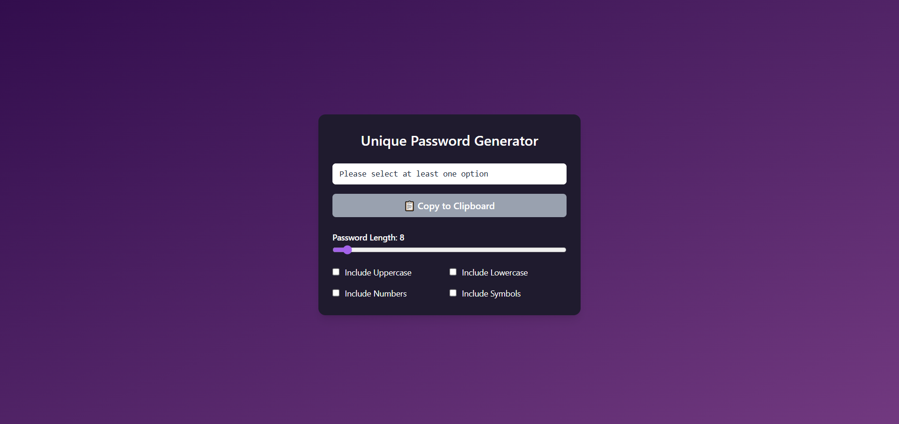

# 🔐 Password Generator App

A responsive and feature-rich password generator built using **React** and **Tailwind CSS**.  
Customize your password with selected criteria and copy it instantly with one click!

 

---

## ✨ Features

- ✅ Generate secure passwords up to 50 characters
- ✅ Toggle:
  - Uppercase letters
  - Lowercase letters
  - Numbers
  - Symbols
- ✅ Live password preview
- ✅ Copy to clipboard
- ✅ Fully responsive layout

---

## 🛠️ Tech Stack

- [React](https://reactjs.org/)
- [Tailwind CSS](https://tailwindcss.com/)
- JavaScript (ES6+)
- Vite

---

## 🚀 Getting Started

### 1. Clone the Repository

```bash
git clone https://github.com/mansigupta2501/Password-generator-app.git
cd Password-generator-app
```

### 2. Install Dependencies

```bash
npm install
```

### 3. Start Development Server

```bash
npm run dev
```

**The app should now be running at:**
**👉 http://localhost:5173**
